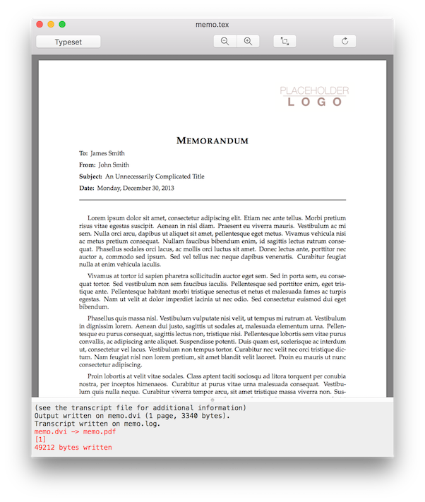

# LiveTeX

LiveTeX is a PDF previewer for TeX writing.  
You can use this app with your favorite editors.

The preview will be updated every time you save the TeX document.  
You can also update the preview manually by using a keyboard shortcut.

## Requirements

Mac OS X 10.11 or later.

## License

LiveTeX is released under the MIT license. See LICENSE for details.
